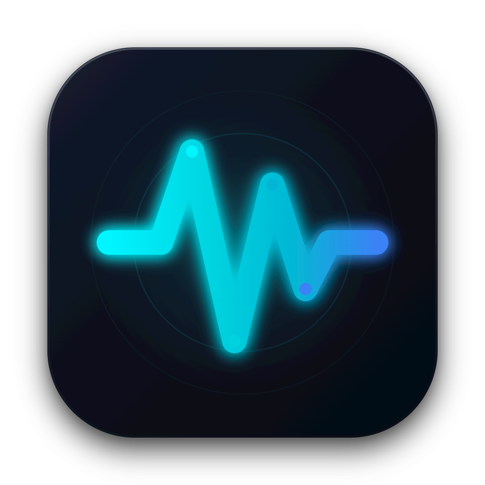
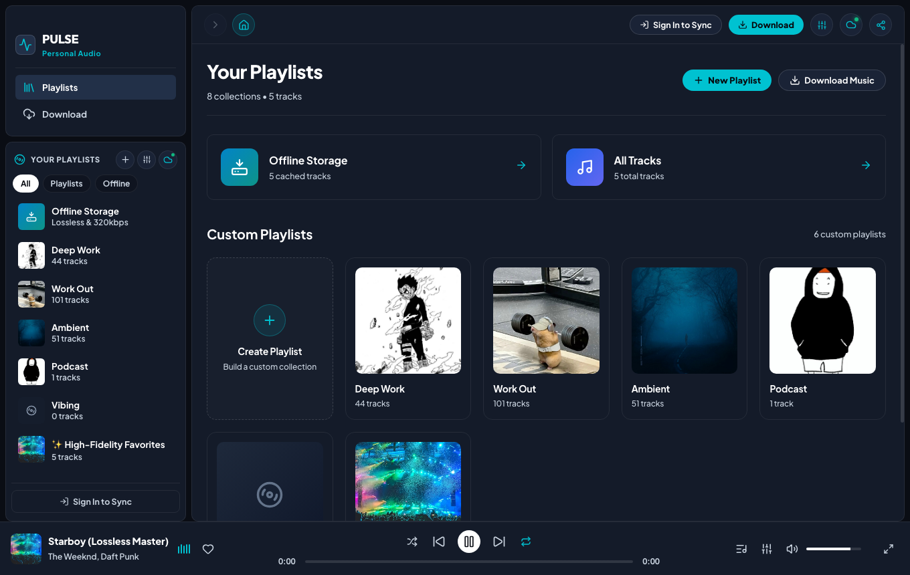
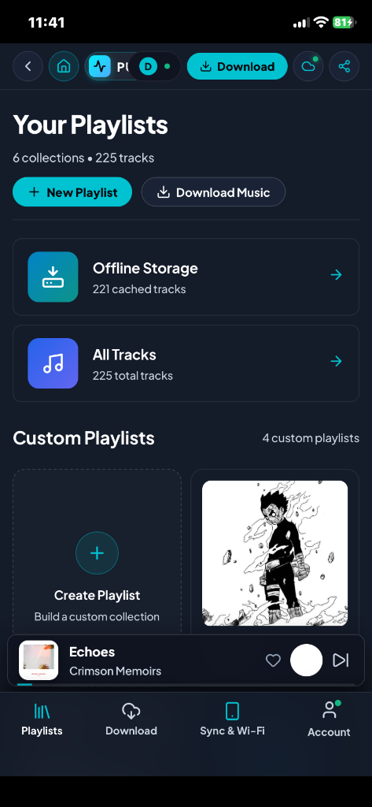
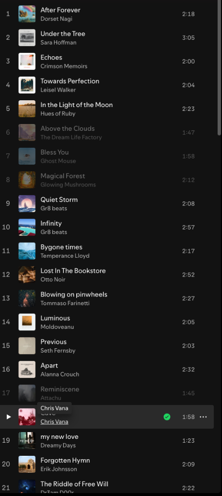
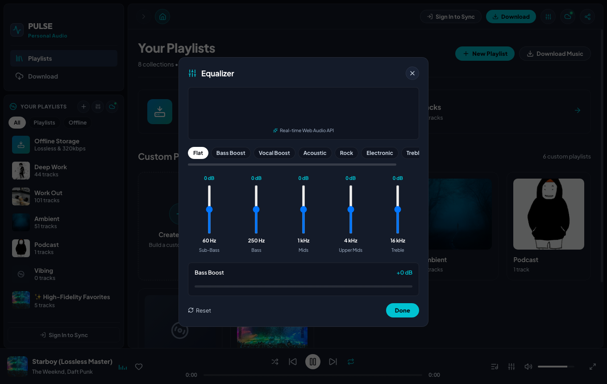
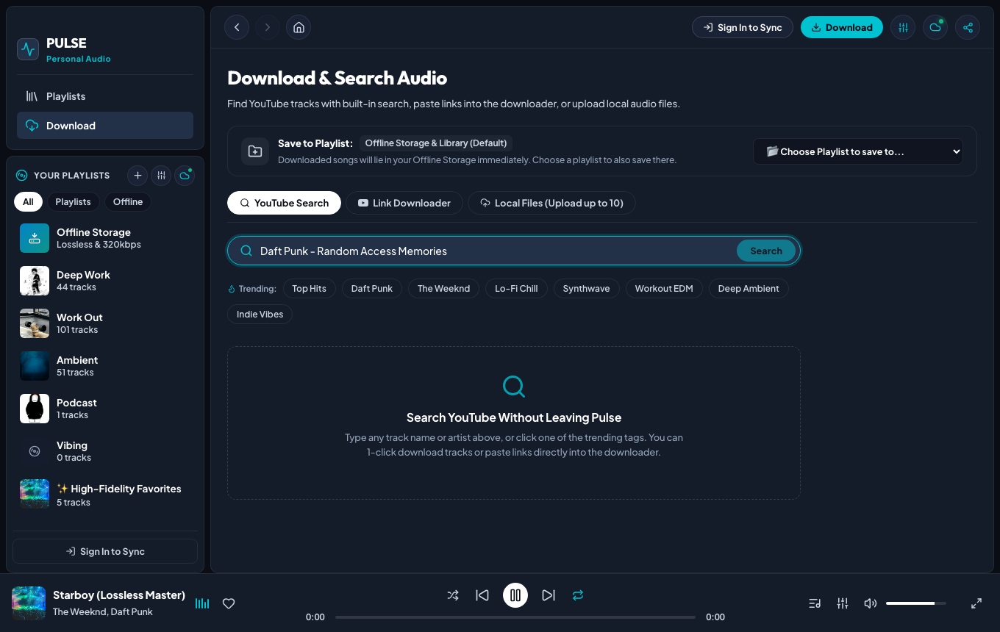

<div align="center">



# ⚡ Pulse — Free Lossless Music Player

**Personal, ad-free, high-fidelity music & podcast player for macOS, iOS, Android, and Web.**  
Zero subscriptions. Zero advertisements. Bit-perfect original audio with continuous background lock-screen playback and cloud library sync.

[](LICENSE)
[](https://github.com/dat-nnguyen/real-free-music-player)
[](https://react.dev/)
[](https://vitejs.dev/)
[](https://www.electronjs.org/)
[](https://capacitorjs.com/)
[](https://supabase.com/)
[](tests/)

<br />



</div>

---

## 📸 Visual Showcase & Demos

Pulse features a tailor-crafted dark glassmorphic design system with neon cyan accents, fluid micro-interactions, and hardware-accelerated audio processing across all devices.

### 📱 Mobile & iPhone Experience (Lock-Screen Playback)

<div align="center">
<table>
  <tr>
    <td align="center" width="50%">
      <b>iPhone Playlists & Dynamic Island View</b><br/><br/>
      
    </td>
    <td align="center" width="50%">
      <b>Native Mobile Tracklist & Now Playing</b><br/><br/>
      
    </td>
  </tr>
</table>
</div>

### 🎛️ Hardware 5-Band Equalizer & Visualizer
Studio-grade parametric equalization powered by the Web Audio API with dedicated Bass Boost and real-time spectrum visualizer canvas.

<div align="center">

</div>

### 📥 Universal Audio Ingestion & YouTube Search
Built-in search engine, direct URL audio downloader, and Apple Podcasts directory.

<div align="center">

</div>

---

## ✨ Key Features

- **💎 Bit-Perfect High-Fidelity Audio Engine**:
  - Preserves master-grade 320kbps MP3, FLAC (24-bit studio lossless), WAV, and AAC/M4A streams.
  - Zero lossy transcoding, artificial dynamic compression, or bitrate degradation.
  - Smooth cross-fade, seamless track chaining, and intelligent audio buffer management.

- **🖥️ Native macOS Desktop Application**:
  - Direct 1-click installation to your Mac's `/Applications` directory (`Pulse.app`).
  - Standalone release `.dmg` installer for easy distribution.
  - Frameless macOS window with native traffic-light buttons and smooth drag zones.
  - High-resolution Retina dock icon and custom menu bar integration.

- **📱 Full iPhone, iPad & Android Support**:
  - **Instant Safari PWA**: Add to Home Screen in seconds for a standalone, fullscreen borderless experience without developer mode.
  - **Native iOS Project**: Full Capacitor Xcode workspace configured with `Audio, AirPlay, and Picture in Picture` background modes.
  - **Continuous Lock-Screen Playback**: Keeps playing when the screen is locked or while using other apps.
  - **MediaSession Control Center Integration**: Dynamic lock-screen album artwork, title/artist display, scrubbing, and headphone remote controls.

- **🎛️ Hardware-Accelerated 5-Band Equalizer**:
  - 5-band parametric filters: **60Hz (Sub-Bass)**, **250Hz (Bass)**, **1kHz (Mids)**, **4kHz (Upper Mids)**, and **16kHz (Treble)**.
  - Independent **Bass Boost** amplifier slider (+0 dB to +12 dB).
  - One-click studio presets: *Flat, Bass Boost, Vocal Boost, Acoustic, Rock, Electronic, Treble Boost*.
  - Live frequency spectrum visualizer analyzing real-time PCM waveforms.

- **📥 Music & Podcast Ingestion Engine**:
  - **Built-in YouTube Search**: Search millions of songs without opening a browser or requiring an external API key.
  - **Direct URL Downloader**: Ingest tracks, albums, or full playlists from YouTube, SoundCloud, and Bandcamp directly into your vault.
  - **Apple Podcasts Directory**: Browse, search, and stream millions of podcast episodes with offline episode caching.
  - **Local Audio Drag & Drop**: Drop `.mp3`, `.flac`, `.wav`, or `.m4a` files straight into Pulse with automatic ID3 metadata and high-res cover art extraction.

- **💾 100% Offline Vault**:
  - Downloaded tracks and artwork are saved directly into your device's persistent IndexedDB storage.
  - Full airplane mode and off-grid listening capability with zero cellular data consumption.

- **☁️ Real-Time Cloud Sync (Supabase Backend)**:
  - Keep playlists, favorites, and library tracks continuously synchronized across your Mac, iPhone, and Web in real time.
  - Row Level Security (RLS) guarantees complete personal data privacy and isolation.
  - 1-click JSON backup export and import for seamless AirDrop transfers between devices.

- **🧭 Native Two-Way Navigation Stack**:
  - Browser-style history stack with **Back (`<`)**, **Forward (`>`)**, and **Home (`🏠`)** TopBar navigation.
  - Keyboard shortcuts: <kbd>⌘</kbd> + <kbd>[</kbd> / <kbd>Alt</kbd> + <kbd>←</kbd> (Back) and <kbd>⌘</kbd> + <kbd>]</kbd> / <kbd>Alt</kbd> + <kbd>→</kbd> (Forward).

- **📋 Desktop Context Menus**:
  - Native right-click context menus on any track or playlist (Play, Add to Playlist, Remove from Playlist, Delete).

---

## 🚀 Quick Start (Local Development)

### Prerequisites

- **Node.js**: v18.0 or later (v20+ recommended)
- **npm** or **pnpm**
- **Git**
- macOS with Xcode (optional, only for building native macOS/iOS binaries)

### 1. Clone & Install Dependencies

```bash
# Clone the repository
git clone https://github.com/dat-nnguyen/real-free-music-player.git
cd real-free-music-player

# Install dependencies
npm install
```

### 2. Launch Local Development Server

```bash
# Start Vite development server (bound to 0.0.0.0 for LAN access)
npm run dev
```

- Open **[http://localhost:5173](http://localhost:5173)** in your desktop browser.
- Open **`http://<your-mac-ip>:5173`** on your iPhone or Android phone on the same Wi-Fi network.

### 3. Launch Backend Companion Server (Optional for Ingestion)

```bash
# Start the audio extraction & metadata companion service (port 3030)
npm run server
```

---

## 💻 macOS Native Desktop App

Pulse packages into a native macOS desktop application using Electron with native window styling and custom dock icon.

### Install Directly to `/Applications`

```bash
# Builds the frontend, packages the macOS app, and installs Pulse.app to /Applications
npm run install:mac
```

Once installed, launch **Pulse** anytime via Spotlight (<kbd>⌘</kbd> + <kbd>Space</kbd> &rarr; *Pulse*) or Launchpad.

### Build Standalone `.dmg` Installer

```bash
# Compiles a distributable macOS Apple Disk Image (.dmg) in release/
npm run dist:mac
```

---

## 📲 iPhone & Mobile Installation

### Option 1: Instant Safari PWA (Recommended — Fast & Wireless)

No cables, no developer mode, and no App Store required:

1. Ensure your iPhone is connected to the same Wi-Fi network as your Mac.
2. In **Safari** on iOS, open your Mac's LAN address:
   ```text
   http://<your-mac-ip>:5173
   ```
3. Tap the **Share** button at the bottom of Safari (the square with the upward arrow `[↑]`).
4. Scroll down and tap **"Add to Home Screen"** (*Thêm vào MH chính*).
5. Tap **Add**. Pulse will appear on your home screen with its custom icon, running in full borderless mode with lock-screen media controls!

### Option 2: Native iOS Build via Xcode (Capacitor)

For an authentic native iOS app compiled via Apple Xcode:

```bash
# 1. Sync the compiled web bundle to the iOS native project
npm run ios:sync

# 2. Open the Xcode workspace
npm run ios:open
```

In **Xcode**:
1. Connect your iPhone via USB.
2. Select your device from the target dropdown.
3. Under **Signing & Capabilities**, select your **Personal Team** (free Apple ID supported).
4. Verify **Background Modes** has `Audio, AirPlay, and Picture in Picture` checked.
5. Press **⌘ + R** to build and run on your device.

---

## ☁️ Cloud Sync & Supabase Backend

Pulse includes cloud synchronization powered by Supabase for cross-device library and playlist parity.

### 1. Environment Configuration

Create a `.env` file in the project root:

```env
VITE_SUPABASE_URL=https://your-project.supabase.co
VITE_SUPABASE_ANON_KEY=your-anon-public-key
```

### 2. Database Schema Deployment

1. Create a free database at [supabase.com](https://supabase.com).
2. Navigate to the **SQL Editor** in your Supabase Dashboard.
3. Paste and execute the contents of [`supabase/schema.sql`](supabase/schema.sql):
   - Provisions `tracks`, `playlists`, `playlist_tracks`, and `likes` tables.
   - Configures the `audio-files` storage bucket.
   - Configures Row Level Security (RLS) ensuring strict isolation between user accounts.

### 3. Signing In on Devices

- Click or tap the **Sync & Wi-Fi** icon in the TopBar or bottom navigation.
- Sign in or register with your email to have your playlists and tracks sync in real time across desktop, iPhone, and web.

---

## ⌨️ Keyboard Shortcuts Reference

| Shortcut | Action |
| :--- | :--- |
| <kbd>Space</kbd> | Toggle Play / Pause |
| <kbd>&larr;</kbd> / <kbd>&rarr;</kbd> | Seek backward / forward 5 seconds |
| <kbd>&uarr;</kbd> / <kbd>&darr;</kbd> | Increase / decrease volume by 5% |
| <kbd>⌘</kbd> + <kbd>[</kbd> / <kbd>Alt</kbd> + <kbd>&larr;</kbd> | Navigate Back in history stack |
| <kbd>⌘</kbd> + <kbd>]</kbd> / <kbd>Alt</kbd> + <kbd>&rarr;</kbd> | Navigate Forward in history stack |
| <kbd>M</kbd> | Toggle Mute / Unmute |
| <kbd>L</kbd> | Like / Favorite current track |
| <kbd>E</kbd> | Open Hardware Equalizer modal |
| <kbd>/</kbd> | Focus search bar |
| <kbd>Esc</kbd> | Close active modal |

---

## 🛠️ Tech Stack & Architecture

```text
real-free-music-player/
├── electron/               # Native macOS Electron desktop integration
│   ├── main.js             # Main process, window lifecycle, dock icon
│   └── preload.js          # Secure IPC preload bridge
├── ios/App/                # Native Capacitor iOS project (Xcode workspace)
├── server/                 # Companion audio extraction & metadata backend
│   ├── controllers/        # Audio download and podcast search handlers
│   ├── services/           # yt-dlp stream extractor, RSS podcast parser
│   └── server.js           # Express API server (Port 3030)
├── src/                    # React 19 Frontend Application
│   ├── components/         # TopBar, Sidebar, PlayerBar, Library, Equalizer, Modals
│   ├── services/           # AudioEngine, IndexedDB Storage, Supabase Sync
│   ├── App.jsx             # Root application coordinator & navigation stack
│   └── index.css           # Glassmorphism design tokens, CSS variables, responsive layout
├── docs/assets/            # High-resolution screenshots and visual demos
├── build/                  # macOS and iOS high-res application icons
├── supabase/               # Database migration schema & storage policies
├── capacitor.config.json   # Native mobile packaging configuration
└── package.json            # Scripts and project dependencies
```

- **Frontend**: React 19, Lucide Icons, Vanilla CSS Glassmorphism Design System
- **Build Tooling**: Vite 8, Vitest (48 automated regression & contract tests)
- **Audio Core**: HTML5 Audio & Web Audio API (BiquadFilterNode parametric equalizer, AnalyserNode)
- **Local Vault**: IndexedDB (`idb`) persistent offline storage
- **Backend & Cloud**: Supabase (PostgreSQL, RLS, Storage), Express 4, yt-dlp
- **Native Packaging**: Electron 44 (macOS), Capacitor 7 (iOS / Android)

---

## 📦 Available Scripts

| Command | Description |
| :--- | :--- |
| `npm run dev` | Launch Vite dev server bound to `--host` for local & mobile access |
| `npm run build` | Build the optimized production client bundle into `dist/` |
| `npm run server` | Launch the audio extraction & metadata companion backend on port 3030 |
| `npm run desktop` | Launch the native desktop app with Electron in development mode |
| `npm run install:mac` | Build, package, and install `Pulse.app` directly to `/Applications` |
| `npm run dist:mac` | Package the release `.dmg` installer for macOS |
| `npm run pack:mac` | Package the macOS directory bundle without generating a DMG |
| `npm run ios:sync` | Sync frontend assets from `dist/` to the Capacitor iOS project |
| `npm run ios:open` | Open the native iOS project in Xcode |
| `npm test` | Run the complete Vitest regression suite (48/48 unit & contract tests) |
| `npm run lint` | Run the code linter (`oxlint`) |

---

## 📄 License

This project is licensed under the [MIT License](LICENSE) — free for personal, educational, and open-source use.
